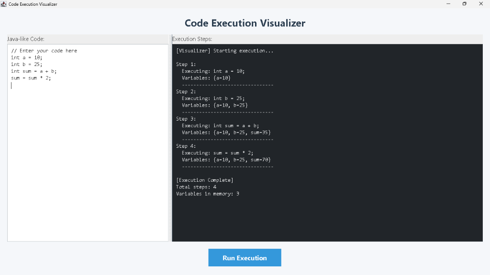

# Code Execution Visualizer Pro

A powerful Java Swing-based desktop application designed to visualize step-by-step code execution. Perfect for students and developers to understand state changes and control flow in real-time.



## 🌟 Features

- **Interactive Code Editor**: Input Java-like code and watch it come to life.
- **Manual Stepping**: Control the execution flow with "Next Step" and "Restart" controls.
- **Line Highlighting**: Real-time visual feedback showing exactly which line is currently being executed.
- **Variable Inspector**: A professional `JTable` view that tracks variable state changes instantly.
- **Conditionals Support**: Basic `if` block handling with automatic line skipping for false conditions.
- **Robust Error Handling**: Detects syntax errors, division by zero, undeclared variables, and more without crashing.

## 🏗️ Architecture & OOP Principles

The project is built with a modular architecture following key Object-Oriented Programming (OOP) principles:

### 1. Abstraction
We use a `Statement` interface to define the behavior of any line of code. This allows the `ExecutionEngine` to execute any command without knowing its internal logic.

### 2. Polymorphism
Different statement types (Declaration, Assignment, Expression, and If) implement the `execute()` method. The engine treats them uniformly as `Statement` objects but they perform distinct operations.

### 3. Encapsulation
Internal state management is strictly controlled.
- `ExecutionEngine` manages the `variableStore` (Map) and `Program Counter`.
- `ExpressionEvaluator` encapsulates the arithmetic and boolean parsing logic.
- UI components are separated from business logic.

### 4. Separation of Concerns
The application is divided into:
- **Parser Layer**: Transforms raw strings into executable `Statement` objects.
- **Execution Layer**: Manages data state and execution flow.
- **Presentation Layer**: Handles Swing components, events, and visual updates.

## 🚀 Getting Started

### Prerequisites
- Java Development Kit (JDK) 8 or higher.

### Installation & Run
1. Clone the repository:
   ```bash
   git clone https://github.com/avy2025/Code-Execution-Visualizer.git
   ```
2. Navigate to the project directory:
   ```bash
   cd Code-Execution-Visualizer
   ```
3. Compile the source code:
   ```bash
   javac -d bin src/visualizer/*.java
   ```
4. Run the application:
   ```bash
   java -cp bin visualizer.Main
   ```

## 🛠️ Tech Stack
- **Language**: Java
- **Framework**: Java Swing (Desktop GUI)
- **Utilities**: `JTable`, `Highlighter`, `Timer`.

---
*Created by Antigravity - Advanced Agentic Coding Assistant*
