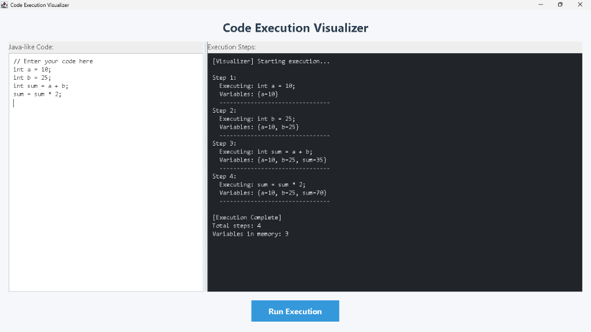
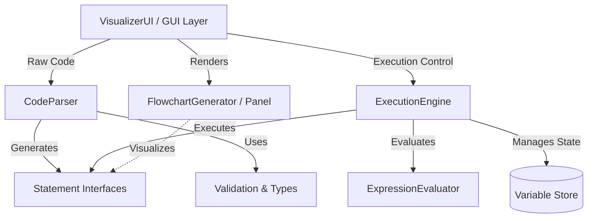
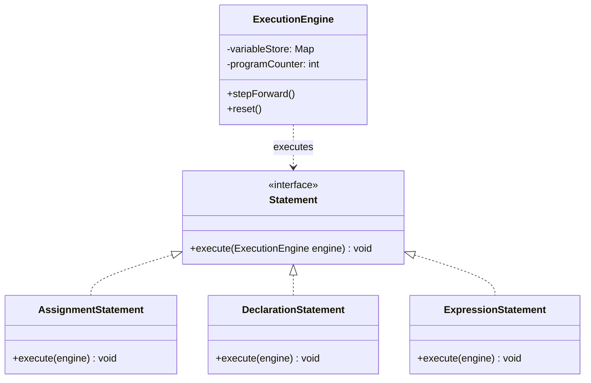

# Code Execution Visualizer Pro

A powerful Java Swing-based desktop application designed to visualize step-by-step code execution. Perfect for students and developers to understand state changes and control flow in real-time.



## 🌟 Features

- **Interactive Code Editor**: Input Java-like code and watch it come to life.
- **Manual Stepping**: Control the execution flow with "Next Step" and "Restart" controls.
- **Line Highlighting**: Real-time visual feedback showing exactly which line is currently being executed.
- **Variable Inspector**: A professional `JTable` view that tracks variable state changes instantly.
- **Conditionals Support**: Basic `if` block handling with automatic line skipping for false conditions.
- **Auto-Flowchart Generation**: Instantly converts source code into a visual control flow diagram with branching logic.
- **Learn & Memorize Hub**: A dedicated section with pro tips on writing clean code and fun mental models to master your logic.
- **Robust Error Handling**: Detects syntax errors, division by zero, undeclared variables, and more without crashing.

## 🏗️ Architecture Design

The project is built with a modular and robust architecture following core Object-Oriented Programming (OOP) principles.

### System Architecture Diagram


```mermaid
graph TD
    UI[VisualizerUI / GUI Layer] -->|Raw Code| Parser[CodeParser]
    UI -->|Execution Control| Engine[ExecutionEngine]
    
    Parser -->|Generates| Statements[Statement Interfaces]
    Parser -->|Uses| Types[Validation & Types]
    
    Engine -->|Evaluates| Expressions[ExpressionEvaluator]
    Engine -->|Manages State| Memory[(Variable Store)]
    Engine -->|Executes| Statements
    
    UI -->|Renders| Flowchart[FlowchartGenerator / Panel]
    Flowchart -.->|Visualizes| Statements
```

### Class Hierarchy Model


```mermaid
classDiagram
    class Statement {
        <<interface>>
        +execute(ExecutionEngine engine) void
    }
    class AssignmentStatement {
        +execute(engine) void
    }
    class DeclarationStatement {
        +execute(engine) void
    }
    class ExpressionStatement {
        +execute(engine) void
    }
    class ExecutionEngine {
        -variableStore: Map
        -programCounter: int
        +stepForward()
        +reset()
    }
    
    Statement <|.. AssignmentStatement
    Statement <|.. DeclarationStatement
    Statement <|.. ExpressionStatement
    ExecutionEngine ..> Statement : executes
```

## 🧠 Core Principles

### 1. Abstraction & Polymorphism
We use a `Statement` interface to define the behavior of any line of code. This allows the `ExecutionEngine` to execute any command without knowing its internal logic. Different types (Declaration, Assignment, Expression) implement `execute()` uniquely.

### 2. Encapsulation & State Management
Internal state management is strictly controlled.
- `ExecutionEngine` manages the `variableStore` and controls the Program Counter (PC).
- `ExpressionEvaluator` encapsulates complex arithmetic and logical parsing logic, shielding the engine from internal computation.
- UI components (View) are strictly decoupled from execution logic (Model).

## 🚀 Getting Started

### Prerequisites
- Java Development Kit (JDK) 8 or higher.

### Installation & Run
1. Clone the repository:
   ```bash
   git clone https://github.com/avy2025/Code-Execution-Visualizer.git
   ```
2. Navigate to the project directory:
   ```bash
   cd Code-Execution-Visualizer
   ```
3. Compile the source code:
   ```bash
   javac -encoding UTF-8 -sourcepath src -d bin src/visualizer/*.java
   ```
4. Run the application:
   ```bash
   java -cp bin visualizer.Main
   ```

## 🛠️ Technology Stack
- **Language**: Java 8+
- **Framework**: Java Swing (Desktop GUI)
- **Graphics**: `Graphics2D` (for custom native flowchart rendering)
- **Core Utilities**: `JTable`, Core Collections API, Custom Parsers.

---
*Created by Antigravity - Advanced Agentic Coding Assistant*
